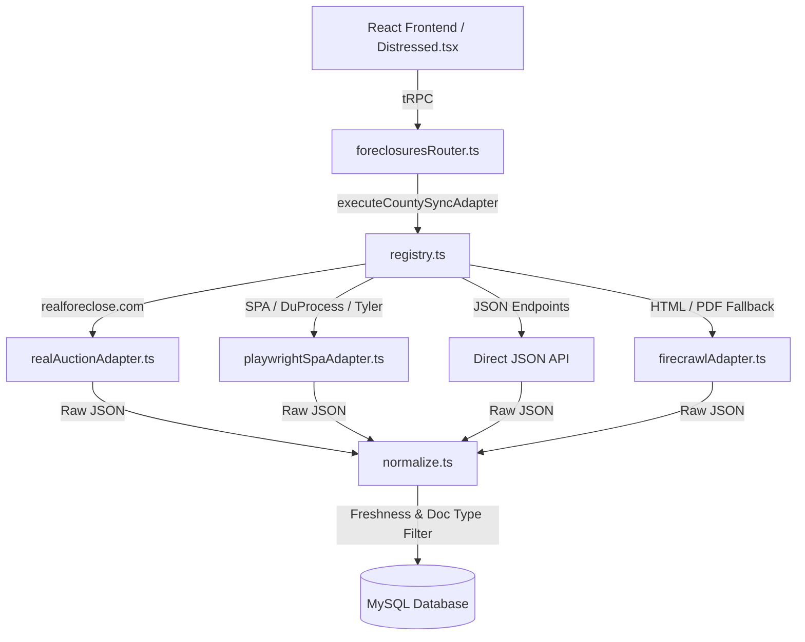

# PropLink Project Audit (AGY_AUDIT.md)

**Date**: July 28, 2026  
**Repository**: [PropLink](file:///Users/jenyanovak/Projects/active/PropLink)  
**Status**: Active / Production-Ready Core  

---

## 1. Executive Summary

PropLink is a full-stack real estate transaction, B2B marketplace, and nationwide distressed property / foreclosure ingestion platform. 

### Key Highlights
- **3,101 US County Directory**: Pre-indexed directory covering all 50 US states (`app/db/county_directory.json`).
- **Multi-Strategy Scraping Engine**:
  1. **RealAuction Adapter**: Specialized for `realforeclose.com` & `taxdeedauction.com`.
  2. **Playwright Headless SPA Adapter**: Obtains data from Angular/React portals (e.g., DuProcess, Tyler Eagle) while bypassing anti-bot 403 blocks.
  3. **Direct JSON API Engine**: Fast native ingestion for standard JSON APIs.
  4. **Firecrawl AI Scraper Engine**: Fallback AI extractor for HTML/PDF/GovOS/ASP.NET portals.
- **Strict Data Quality & Freshness Controls**:
  - Rejection of past auction dates and legacy filing records (2020–2025).
  - Explicit document filtering excluding non-foreclosure types (`DEED`, `MORTGAGE`, `SATISFACTION`, `LIEN`).
  - Automatic zero-value sanitization for monetary fields.
- **Robust UI Safety**: Confirmation modal (`AlertDialog`) for connector deletion to prevent accidental loss.

---

## 2. Tech Stack Overview

| Category | Technology |
|---|---|
| **Frontend** | React 19, Vite, Tailwind CSS, Lucide Icons, Shadcn UI Components |
| **Backend API** | Node.js, tRPC, Express |
| **Database & ORM** | MySQL 8, Drizzle ORM |
| **Scraping & Browser Automation** | Playwright (Chromium), Firecrawl AI API, Native Fetch |
| **Testing** | Vitest (30/30 unit tests passing) |

---

## 3. Architecture & Core Modules

---

## 4. Ingestion & Adapter Breakdown

1. **`app/api/foreclosure/normalize.ts`**:
   - `NON_FORECLOSURE_TYPES` blocklist for deeds, mortgages, liens, and releases.
   - `isFreshRecord()` verification (excludes expired auctions & legacy filings).
2. **`app/api/foreclosure/adapters/playwrightSpaAdapter.ts`**:
   - Headless Chromium with custom headers, automated disclaimer clicker, and Angular grid row extractor.
3. **`app/api/foreclosure/adapters/registry.ts`**:
   - Automated routing based on URL signatures (`duprocess`, `realforeclose`, `iasworld`, `json_api`).

---

## 5. Verification & Test Suite

- **Vitest Suite**: `3 passed (30 tests total)`
  - `api/schemas.test.ts` (15 tests)
  - `api/uploads.test.ts` (9 tests)
  - `api/emailAuth.test.ts` (6 tests)
- **TypeScript Typecheck**: `npx tsc --noEmit` — **0 Errors**.

---

## 6. Recommendations & Next Steps

1. **Scheduled Sync Cron**: Implement automated background sync timers for high-priority counties.
2. **Proxy Pool Integration**: Rotate residential proxies within the Playwright adapter for strict anti-scraping counties.
3. **Property Geocoding**: Auto-populate missing lat/lng coordinates for newly scraped foreclosure parcels.
